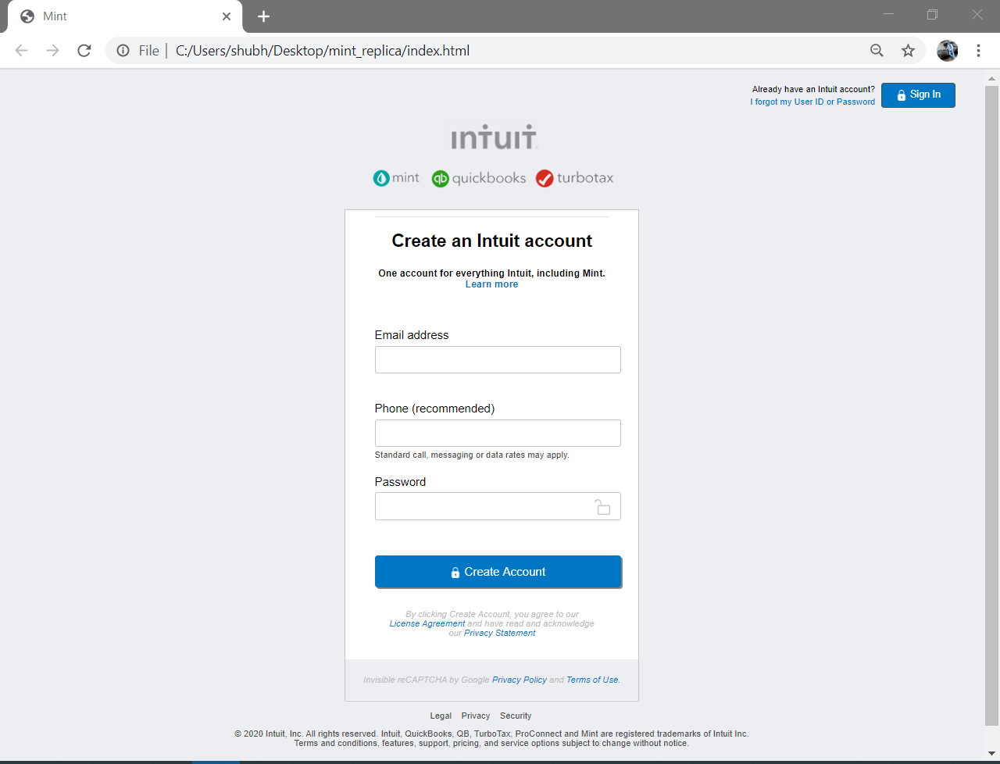

# Mint Replica

>  The goal here is to produce an exact replica of Mint.com for signing up new users.Mint have been highly praised for the design and simplicity of their site, and their signup process is very clean

Additional description about the project and its features.

## Built With

- HTML,
- CSS,
- Visual Studio Code

## Getting Started

**This is an example of how you may give instructions on setting up your project locally.**
**Modify this file to match your project, remove sections that don't apply. For example: delete the testing section if the currect project doesn't require testing.**

To get a local copy up and running follow these simple example steps.

git clone https://github.com/shubham14p3/mint_replica.git

## Authors

👤 **Shubham**

- Github: [@shubham14p3](https://github.com/shubham14p3/)
- Linkedin: [@shubham14p3](https://linkedin.com/shubham14p3)

## 🤝 Contributing

Contributions, issues and feature requests are welcome!

Feel free to check the [issues page](https://github.com/shubham14p3/mint_replica/issues).

## Show your support

Give a ⭐️ if you like this project!

## 📝 License

This project is [MIT](lic.url) licensed.
